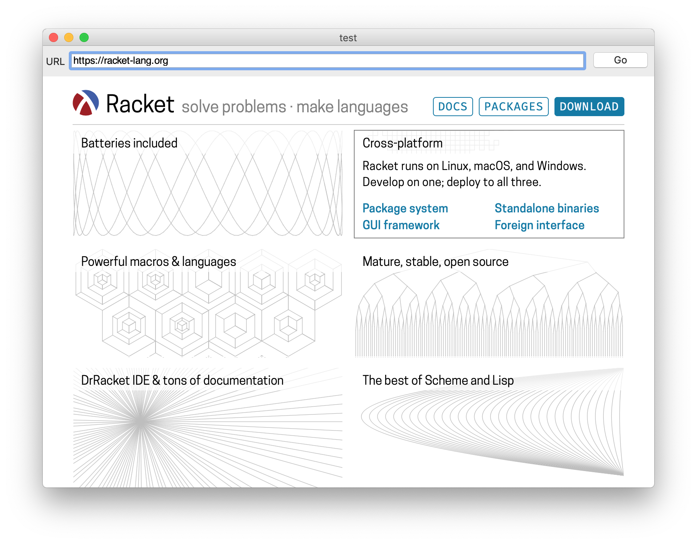

web-view%
========



A Racket package to provide a `web-view%` control to applications based on Racket GUI Toolkit.

There is some minimal [documentation available](https://soapdog.github.io/racket-web-view/).

## What works

You can create a `web-view%`, set its URL and the page loads. You can navigate as well.

## What doesn't work

Everything else.

Also, at the moment it is macOS only. It wraps around WKWebView.

# Demo

Install the package with the following command on the checkout folder for this repo:

```
$ raco pkg install
```

You can run a demo with by loading `demo/demo.rkt`.

# Sample code:

```
(define web-view
  (new web-view%
       [parent panel]))

(send web-view set-url "https://racket-lang.com")
```

---

<a href="http://racket-lang.org/"></a>